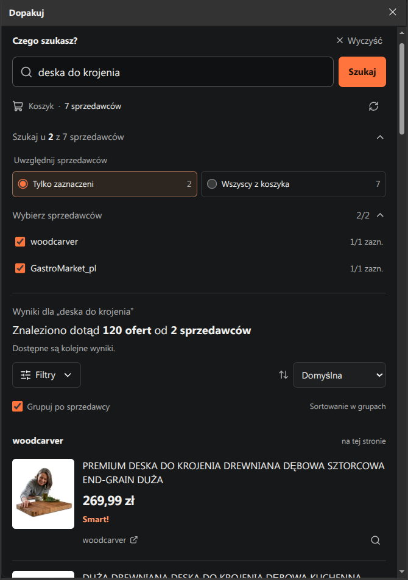

# Dopakuj

Rozszerzenie do Chrome, Edge i Opery, które pomaga znaleźć dodatkowe produkty u sprzedawców, od których już coś kupujesz na Allegro.

Przykład: masz w koszyku kawę od trzech sprzedawców i chcesz dorzucić filtry do ekspresu. Zamiast otwierać każdy sklep osobno, wpisujesz „filtry”, a rozszerzenie zbiera pasujące oferty w jednym panelu.

Projekt jest nieoficjalny i nie jest powiązany z Allegro. Rozszerzenia nie ma w oficjalnych sklepach przeglądarek — instaluje się je ręcznie.

## Podgląd



## Instalacja — bez programowania

Nie potrzebujesz Node.js, Git ani żadnych narzędzi programistycznych.

1. Wejdź w **Releases** po prawej stronie tego repozytorium i otwórz najnowszą wersję.
2. W sekcji **Assets** pobierz ZIP przeznaczony dla swojej przeglądarki:

   ```text
   dopakuj-extension-chrome-edge-v1.0.0.zip
   dopakuj-extension-opera-v1.0.0.zip
   ```

   Nie wybieraj automatycznego pliku **Source code**.

3. Rozpakuj pobrany ZIP. W środku znajdziesz gotowy folder odpowiedni dla przeglądarki.
4. Przenieś ten folder w stałe miejsce, na przykład do Dokumentów. Nie usuwaj go po instalacji.
5. Otwórz stronę rozszerzeń:
   - Chrome: wpisz w pasku adresu `chrome://extensions`;
   - Edge: wpisz w pasku adresu `edge://extensions`;
   - Opera: wpisz w pasku adresu `opera://extensions`.

6. Włącz **Tryb dewelopera**.
7. Kliknij **Załaduj rozpakowane**.
8. Wskaż rozpakowany folder `DopakujExtension-ChromeEdge` albo `DopakujExtension-Opera`. W jego środku znajduje się plik `manifest.json`.
9. W Chrome lub Edge opcjonalnie przypnij rozszerzenie do paska przeglądarki. W Operze włącz **Dopakuj** w konfiguracji paska bocznego, jeśli ikona nie pojawiła się automatycznie.

Gotowe. Ostrzeżenie o rozszerzeniu uruchomionym w trybie deweloperskim jest w tym przypadku normalne.

> ZIP-a nie da się zainstalować bezpośrednio. Najpierw trzeba go rozpakować.

## Jak używać

1. Otwórz Allegro i przejdź do koszyka.
2. Kliknij ikonę **Dopakuj** na pasku narzędzi Chrome/Edge albo na pasku bocznym Opery. Z boku przeglądarki otworzy się panel.
3. Wpisz nazwę produktu, którego szukasz.
4. Wybierz sprzedawców zaznaczonych w koszyku, wszystkich albo tylko wybrane osoby.
5. Kliknij **Szukaj**.

Wyniki możesz filtrować, sortować i grupować według sprzedawcy. Kliknięcie oferty otwiera ją na Allegro.

Sprzedawcy są sprawdzani kolejno, więc przy większym koszyku wyszukiwanie może chwilę potrwać. Jeżeli Allegro pokaże CAPTCHA, rozszerzenie otworzy zwykłą kartę, w której trzeba ręcznie przejść weryfikację.

## Aktualizacja rozszerzenia

1. Pobierz ZIP z najnowszego Release.
2. Rozpakuj go.
3. Na stronie `chrome://extensions`, `edge://extensions` albo `opera://extensions` usuń starą wersję.
4. Kliknij ponownie **Załaduj rozpakowane** i wskaż nowy folder.

Przy takiej aktualizacji lokalne ustawienia rozszerzenia mogą zostać wyzerowane.

## Prywatność

Rozszerzenie działa lokalnie w przeglądarce. Nie ma własnego serwera, analityki ani konta użytkownika.

- odczytuje z koszyka nazwy sprzedawców oraz informację, które produkty są zaznaczone;
- otwiera publiczne strony ofert sprzedawców;
- zapisuje tylko lokalne ustawienia i tymczasowy stan wyszukiwania;
- nie ma uprawnienia do bezpośredniego odczytu ciasteczek;
- nie odczytuje haseł, danych płatniczych ani tokenów logowania.

Strony Allegro otwierane przez rozszerzenie działają jak zwykłe karty przeglądarki, dlatego korzystają z normalnej sesji zalogowanego użytkownika.

Pełny opis znajduje się w [PRIVACY.md](./PRIVACY.md).

## Ograniczenia

Rozszerzenie odczytuje strukturę stron Allegro. Jeśli Allegro zmieni wygląd lub kod koszyka i list ofert, część funkcji może przestać działać do czasu aktualizacji.

Rozszerzenie nie omija CAPTCHA ani innych zabezpieczeń. Sortowanie i filtrowanie dotyczą ofert pobranych podczas bieżącego wyszukiwania, a nie od razu całego sklepu sprzedawcy.

---

## Dla autora — przygotowanie nowego Release

Ta część jest potrzebna tylko osobie rozwijającej projekt.

### Pierwsze uruchomienie

Wymagane są Node.js 20.19 lub nowszy i pnpm 10:

```powershell
corepack enable
pnpm install
```

### Gotowy ZIP jedną komendą

Najpierw ustaw numer wersji w `package.json`, na przykład `1.1.0`. Następnie uruchom:

```powershell
pnpm release
```

Na Ubuntu/Linux użyj:

```bash
pnpm release:linux
```

Skrypt linuksowy wymaga programu `zip`. Jeśli nie jest zainstalowany:

```bash
sudo apt install zip
```

Skrypt automatycznie:

1. uruchomi testy;
2. sprawdzi typy TypeScript;
3. zbuduje osobne wersje dla Chrome/Edge i Opery;
4. utworzy dwa gotowe ZIP-y w folderze `release`.

Przykładowy wynik:

```text
release/dopakuj-extension-chrome-edge-v1.1.0.zip
release/dopakuj-extension-opera-v1.1.0.zip
```

Na GitHubie wybierz **Releases → Draft a new release**, wpisz tag zgodny z wersją, na przykład `v1.1.0`, przeciągnij oba ZIP-y do sekcji **Assets** i opublikuj Release.

### Pozostałe polecenia

```bash
pnpm dev          # uruchamia tryb developerski dla Chrome/Edge
pnpm dev:opera    # uruchamia tryb developerski dla Opery
pnpm build        # buduje obie wersje rozszerzenia
pnpm build:chrome # buduje wersję dla Chrome/Edge
pnpm build:opera  # buduje wersję dla Opery
pnpm test         # uruchamia testy
pnpm typecheck    # sprawdza typy
pnpm preview:ui   # pokazuje podgląd panelu
pnpm icons        # generuje ikony PNG z public/icon.svg
```

Projekt korzysta z Manifest V3, WXT, Vue 3 i TypeScript. Główne parsery stron Allegro znajdują się w:

- `adapters/allegro-cart.adapter.ts`;
- `adapters/allegro-offers.adapter.ts`.
